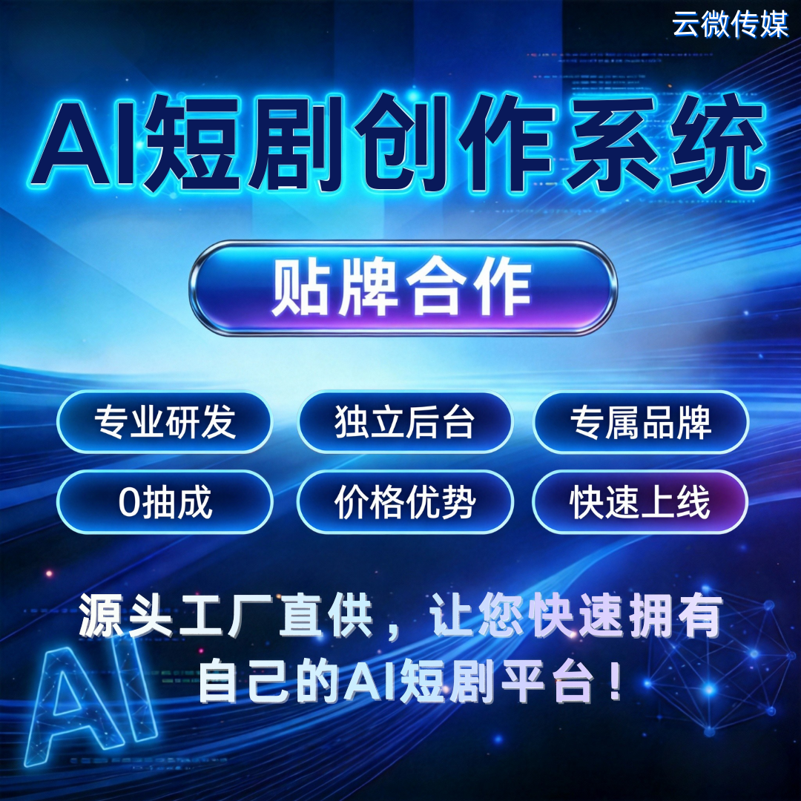

# 云微AI短剧创作系统·贴牌合作：低成本抢占AI短剧风口

AI短剧正处爆发前夜，想快速布局却受技术、成本、周期制约？云微AI短剧创作系统贴牌合作，以源头工厂直供模式，帮你1-3天拥有专属AI短剧平台，零技术也能轻松入局，独享品牌与全量收益，错过再无低成本入场机会。

### 一、五大核心优势，合作更有底气

- 技术靠谱有支撑：自有AI研发团队，全流程提供专业技术支持，规避第三方技术依赖风险，无需自建研发团队，省心省力。
- 成本可控有优势：规模化研发摊薄成本，给出极具竞争力的合作价格，大幅降低前期投入，提升市场定价话语权。
- 品牌独立显专业：全程植入你的域名、LOGO、界面设计，用户全程只看到你的品牌，强化品牌认知与用户信任。
- 收益全拿不打折：平台所有收入直接进入你的账户，官方0抽成，最大化锁定盈利空间。
- 快速上线抢先机：1-3天即可完成部署配置，比自主开发节省90%时间，快速抢占AI短剧市场窗口。

### 二、贴牌合作，解锁真正自主品牌

合作后可拥有完全自主的运营权限，彻底掌握主动权：
- 独立后台管控，播放、收益、用户等核心数据100%归你所有，无需担心数据泄露；
- 支持自主定价，灵活搭建广告变现、付费解锁、会员订阅等多元模式，适配不同运营需求。

云微仅提供背后技术支撑，让你专注品牌运营与市场拓展。

### 三、全流程自动化，创作运营双高效

系统覆盖AI短剧创作全链路，从剧本AI生成、角色场景创建，到语音合成、视频生成，全程自动化完成，大幅降低内容制作成本与门槛，非专业人员也能快速产出优质短剧。同时配备完善运营支持，无需技术基础，新手也能顺畅操作。

### 四、极简合作流程，快速落地见效

无需复杂对接，四步即可完成合作上线：
1. 沟通需求，定制适配方案；
2. 签约付款，锁定合作权益；
3. 1-3天部署配置，完成品牌植入；
4. 专业培训，助力上线运营，后续持续提供技术运维支持，全程兜底。

### 五、适配人群，精准对接需求

无论你是：
- 想转型的内容公司/MCN、布局数字化的区域媒体；
- 开拓新业务的教培机构、需要内容营销的品牌方；
- 想抓住AI短剧风口的团队；
都能适配合作，低成本开启新盈利赛道。
 
常见顾虑全打消：
无技术团队可正常运营，系统适配非专业人员，配套详细培训与持续指导；客户数据独立存储、严格加密，保障数据安全。

**AI短剧风口转瞬即逝，现在合作入场成本最低、机会最大，携手云微，快速搭建专属AI短剧平台，抢占行业红利！**

### 商务微信：ywyy6798

