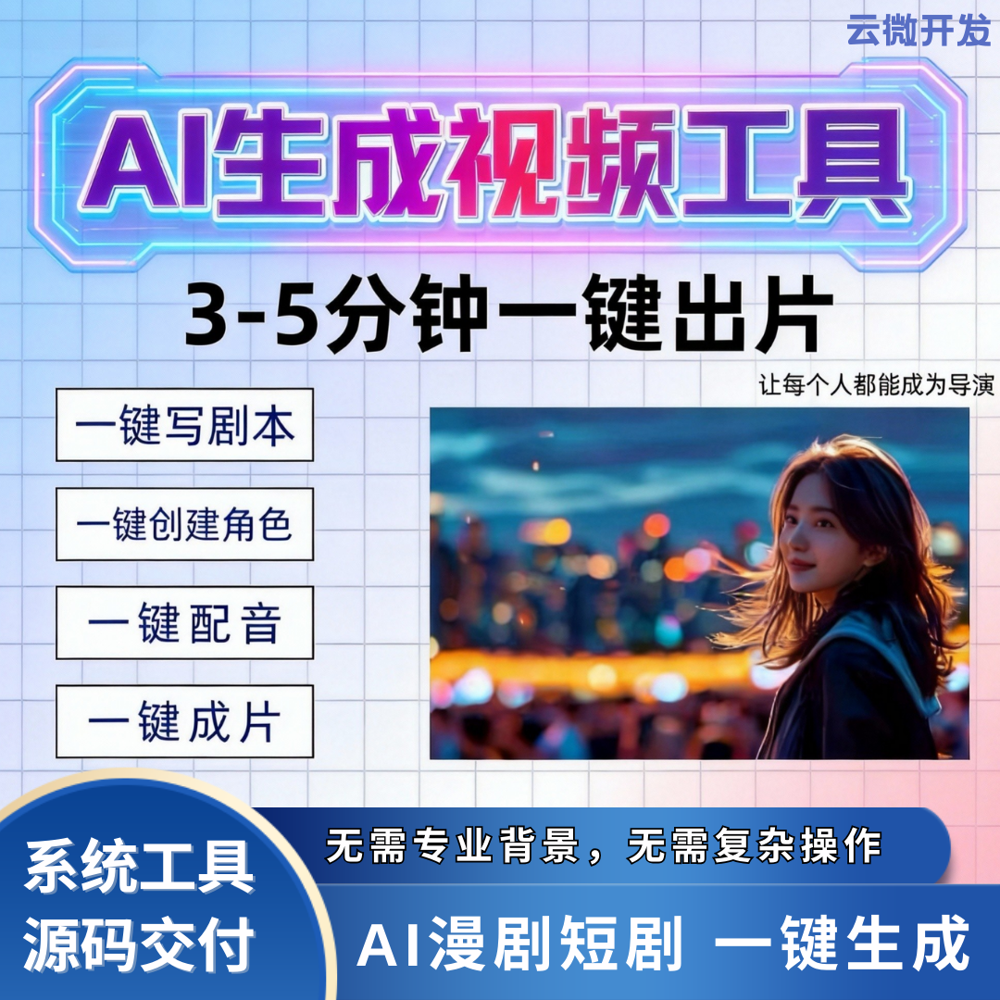

# AI短剧创作系统贴牌合作：零技术、低成本，快速拥有自主品牌

想入局 AI 短剧赛道，又缺技术、缺研发、缺团队？

贴牌合作，就是普通人与中小团队最稳的捷径。不用开发、不用重金投入，轻松打造专属自己的 AI 短剧品牌。

### 一、零技术门槛，小白也能上手

- 全程无需懂代码、服务器、运维，不用组建开发与技术团队；
- 源头技术方包揽部署、调试、功能配置，自己只负责运营接单；
- 提供手把手实操培训 + 完整使用文档，几分钟就能学会后台出片。

### 二、低成本入局，轻资产无压力

- 省去自研几十万开发成本，不用长期养技术人员；
- 一次性合作，无高额年费、无隐形消费，收益全部归自己；
- 小投入就能搭建完整 AI 短剧创作平台，大幅降低试错风险。

### 三、快速落地，立刻拥有自主品牌

- **支持全维度贴牌**：自定义 LOGO、品牌名称、前台界面、后台版权；
- 替换自有域名，打造独立品牌形象，用户、数据、流量全沉淀在自己手里；
- 短时间完成上线，不用等待漫长开发周期，抓住当下流量风口。

### 四、系统能力成熟，商用直接落地

**贴牌即拥有全套核心功能**：
- AI 自动生成剧本、角色、配音、字幕、剪辑成片；
- 短剧、漫剧、小说推文多品类全能制作；
- 支持矩阵批量出片、多平台分发，适配个人创业、MCN 运营、商家接单。

### 五、售后长期护航，不用后顾之忧

- 提供持续系统迭代、bug 修复，紧跟平台规则更新功能；
- 专业技术对接，日常问题快速响应，不耽误运营变现；
- 可升级独立部署、源码交付，后期想扩大业务也能无缝拓展。

## 🤝 商务微信：ywyy6798

AI 短剧贴牌合作，核心就是：零技术省心、低成本稳投、快速度建品牌。

不用重复造轮子，直接拿成熟系统改品牌、快速上线，专注运营与变现，轻松拥有属于自己的 AI 短剧原创平台，稳稳抓住内容创作红利。

