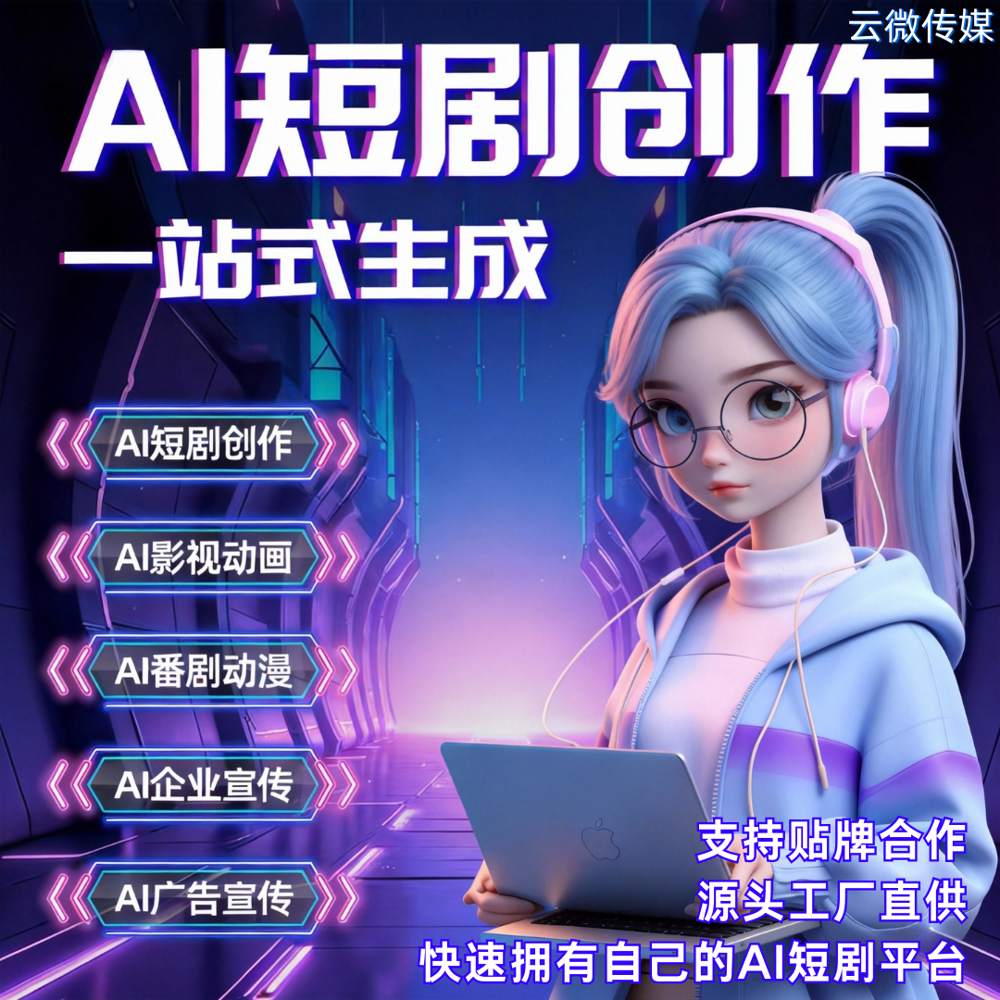

# 做 AI 项目不踩坑：AI 短剧创作系统源头技术商，稳定系统 + 长期维护

近几年 AI 短剧创业热度暴涨，很多创业者盲目跟风，随便套用低价工具、二手贴牌系统，最后频繁翻车：系统崩溃、功能残缺、售后失联、频繁限流封号，投入的时间和成本全部白费。

想要 AI 项目长久盈利，选对源头技术厂商才是避坑关键。

### 一、市面 AI 短剧项目常见坑点

- **三无拼凑系统**：源码二次倒卖、漏洞多，运行卡顿、频繁闪退，随时停服跑路；
- **无技术迭代**：跟不上平台规则更新，内容容易违规、过审困难；
- **售后缺失**：卖完就失联，出现问题无人修复，运营完全被动；
- **功能阉割**：只有基础成片功能，无法批量生产、矩阵分发，很难放大收益。

### 二、选择源头技术商，从根源规避风险

- 系统原生自研，运行稳定耐用原生架构开发，经过长期实测打磨，抗压性强、不易崩溃。完整功能不阉割，AI 剧本、角色创建、智能配音、自动成片、批量混剪全覆盖，长期商用无压力。
- 持续版本迭代，紧跟行业规则专人负责系统更新优化，适配短视频平台审核机制与流量规则。实时优化 AI 画面质量、内容合规性，降低封号、限流风险，让项目长久运营。
- 长期专属维护，售后有保障拒绝一锤子买卖，提供长期技术维护、故障修复、问题答疑。新手提供操作指导、运营建议，不用懂技术，也能安心做项目。

### 三、商用级能力，适配多种变现需求

- 支持短剧、漫剧、小说推文多类型内容生成，覆盖主流变现赛道；
- 可贴牌定制、私有化部署、二开拓展，满足个人、商家、MCN 不同需求；
- 支持矩阵账号批量创作与分发，高效填充内容库，稳定持续产出。

### 四、轻资产入局，低成本长期深耕

不用重金自研、不用组建技术团队，直接对接源头厂商。

低门槛、低风险，系统稳定不掉线，售后全程兜底，告别反复换系统、不断踩坑的内耗。

## 🤝 商务微信：ywyy6798

做 AI 短剧项目，短期看价格，长期看稳定与售后。避开拼接盗版、无售后的劣质系统，认准源头技术合作，才能实现稳定产出、合规运营、持续变现。

广州云微传媒深耕 AI 短剧技术研发，稳定成熟系统 + 终身迭代维护，帮创业者稳稳扎根 AI 赛道，长久盈利不踩坑。

