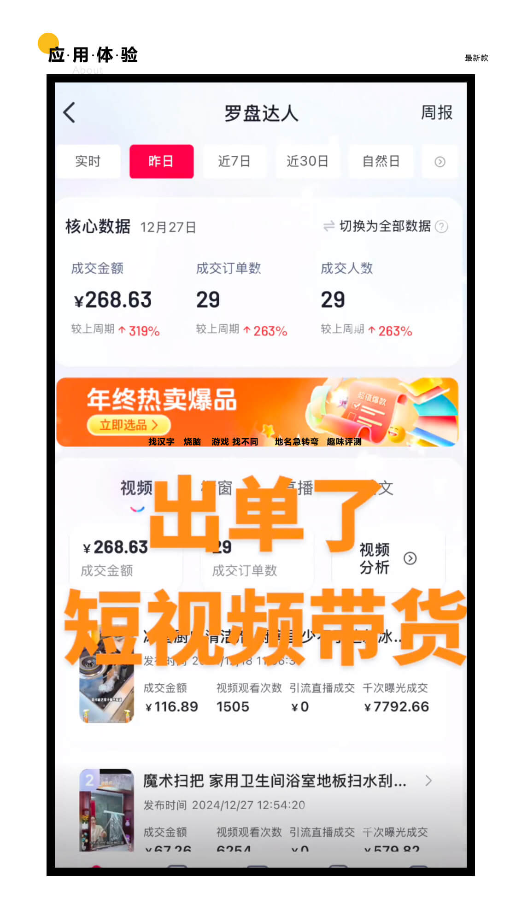
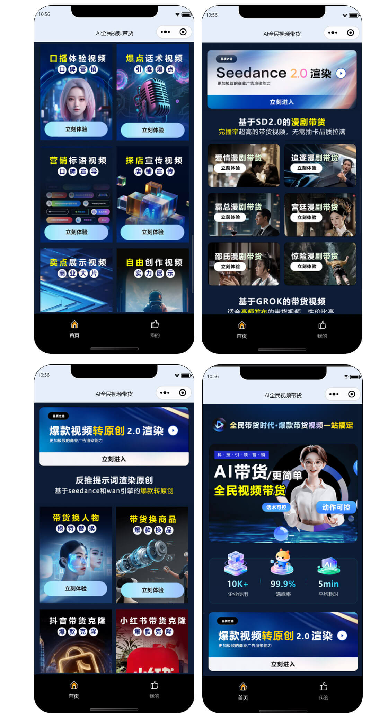
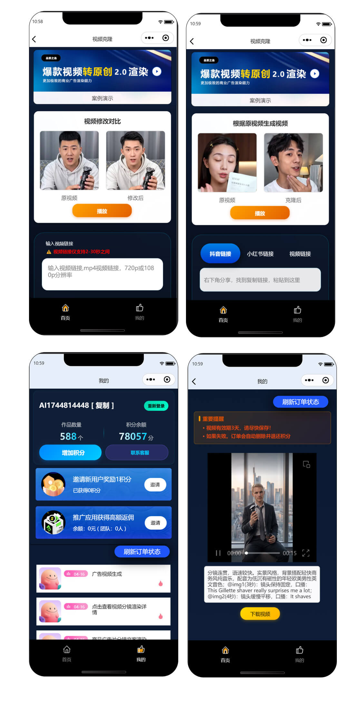

# GPT-image-2 赋能私域！自有品牌怎么做 AI 带货？AI 短剧贴牌私有化独立运营

### 一、GPT-image-2 流量爆发，品牌 AI 带货已成必然

随着GPT-image-2多模态模型持续刷屏出圈，AI 视频创作能力全面升级，高清画面、连贯剧情、智能内容生成，彻底解决传统 AI 内容质感差、转化弱的痛点。

越来越多自有品牌不再依赖第三方达人与公共流量，开始布局专属 AI 带货体系。

低成本、可长效运营的 AI 短剧模式，成为品牌降本拓客、提升销量的关键布局。

### 二、品牌做 AI 带货的痛点

很多品牌想转型 AI 带货，但普遍面临难题：
- 自研成本高、开发周期长、模型对接复杂、无技术团队支撑。
- 直接使用通用 SaaS 工具，品牌标识受限、数据不独立、功能无法定制，容易陷入同质化，不利于长期品牌打造。

而 AI 短剧带货系统贴牌定制 + 私有化部署，就是自有品牌最优解。

### 三、贴牌私有化运营，打造品牌专属 AI 带货体系

广州云微传媒 AI 短剧带货系统，深度集成GPT-image-2核心生成能力，支持全流程贴牌定制与私有化独立部署。
- **全品牌贴牌打造**：自定义 LOGO、品牌名称、后台界面、域名版权，去除我方标识，打造 100% 属于自己的品牌 AI 带货平台。
- **GPT-image-2 强力加持**：依托热门模型超清渲染与智能剧情创作，自动生成品牌种草短剧、产品带货短视频，画面精致、剧情自然，适配多平台分发。
- **私有化独立部署**：系统独立部署在品牌自有服务器，数据完全自主可控，客户数据、创作内容、运营数据不外流，安全合规。
- **功能灵活二开定制**：可根据品牌行业属性、产品品类，定制专属模板、植入产品、定制营销功能，贴合品牌商业化运营需求。

### 四、低成本快速起盘，品牌长效增收

- 无需高额研发投入，直接套用成熟系统，快速上线专属 AI 带货项目。
- 无需真人拍摄、不用达人合作，依靠 AI 批量产出带货内容，全天候引流曝光，以电商佣金、产品直销为核心，拓宽品牌变现渠道。
- 自有品牌借助 GPT-image-2 风口，搭配贴牌私有化模式，告别流量依赖，构建私域 + 公域双驱动的 AI 营销壁垒。

## 🤝 商务微信：ywyy6798

- 广州云微传媒作为源头技术厂商，提供 AI 短剧系统贴牌、私有化部署、源码交付、二次开发全包服务。
- 全程技术协助、快速搭建、售后运维扶持，帮助自有品牌轻松搭建专属 AI 带货生态，抢占 AI 电商时代红利。
- 品牌如需了解贴牌方案、系统演示、定制报价，可随时咨询对接。

