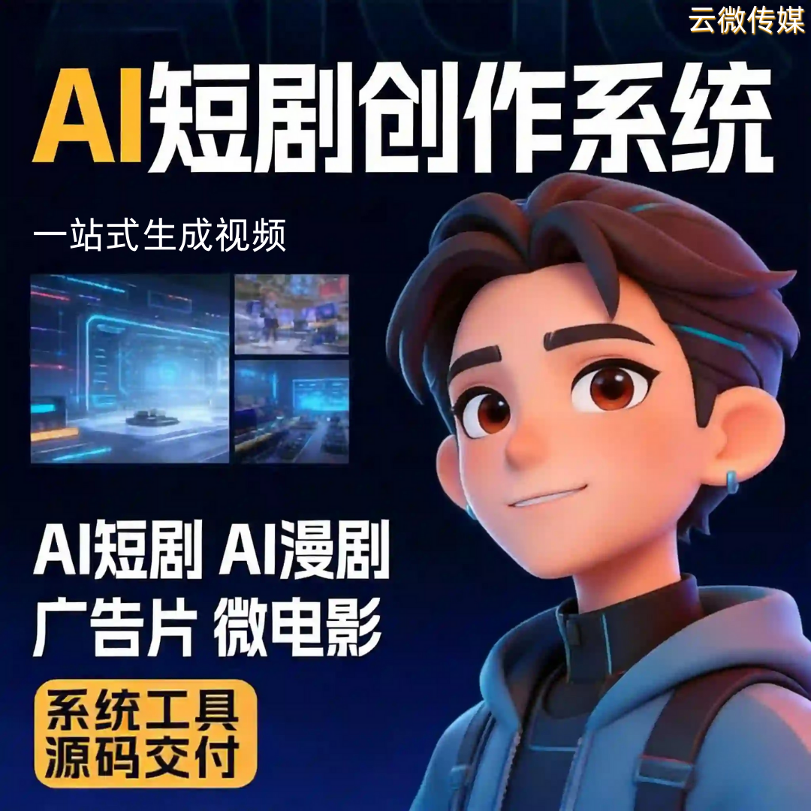

# 贴牌定制自有 AI 短剧创作平台，品牌独立、营收全权把控

很多做 AI 短剧矩阵、内容变现的团队，长期依赖第三方公有平台：品牌不属于自己、数据被截留、收益被抽成，辛苦引流最终为他人做嫁衣。

贴牌定制专属 AI 短剧创作平台，低成本拥有自主品牌系统，完全自主掌控品牌、数据与全部收益。

### 一、全维度品牌贴牌，打造专属独立平台

支持完整 OEM 白标定制，可自定义 LOGO、品牌名称、界面 UI、独立域名与版权信息，彻底去除第三方标识。

对外展示专属品牌形象，无论是招商合作、矩阵运营还是客户交付，专业度与信任感大幅提升，告别公用平台同质化问题。

### 二、全套 AI 创作能力，自动化批量出片

- 内置成熟 AI 全链路创作功能，自动完成剧本生成、角色建模、场景渲染、智能配音、字幕剪辑一站式成片。
- 支持真人短剧、AI 漫剧多风格产出，可批量生成差异化素材，完美适配矩阵账号铺量需求，有效规避平台同质化限流。
- 无需组建编导、剪辑团队，大幅降低人力运营成本。

### 三、数据完全私有，全程自主掌控

区别于第三方平台数据托管，贴牌系统所有用户数据、创作素材、运营数据本地留存，不外流、不共享。

独立后台权限管控，数据可视化统计，播放、产出、引流数据一目了然。

彻底摆脱平台限制，不用担心封号、清数据、功能阉割等问题，适合长期规模化运营。

### 四、收益全权把控，无任何平台抽成

- 自有平台所有变现收益全额归属自己，零中间商抽成、无阶梯扣费。
- 可自由配置广告变现、付费解锁、会员套餐、招商授权等多种盈利模式。
- 自主定价、自主结算，收益模型灵活调整，最大化提升整体利润空间，真正实现流量价值全留存。

### 五、低成本快速落地，无需技术研发

- 依托现成成熟系统贴牌部署，无需从零开发源码，1-3 天即可上线落地。
- 无需专业技术团队维护，后台可视化操作，零基础即可完成内容创作、账号管理、参数配置。
- 支持持续功能迭代与系统更新，长期稳定运营，轻资产搭建属于自己的 AI 短剧商业体系。

## 🤝 商务微信：ywyy6798

做 AI 短剧赛道，短期拼流量，长期拼品牌与私域资产。

贴牌定制自有 AI 短剧平台，摆脱依附、自主经营、收益全收，是工作室、MCN 与创业者规模化变现的最优解法。

