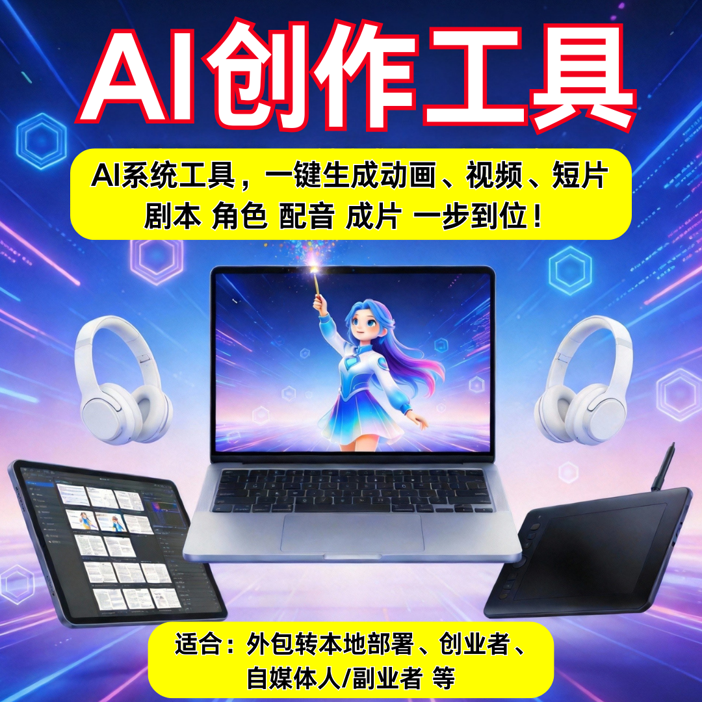

# AI 短剧创业不踩坑：源头技术商 = 稳定系统 + 长期技术支持

想入局 AI 短剧创业，最怕的就是踩坑：系统不稳定、成片率低、售后找不到人、被割一波就跑路……

想真正做长久、做稳定，核心只有一个：选对源头技术商。

### 一、AI 短剧创业，最容易踩哪些坑？

- 系统半成品，剧本、配音、出片经常报错，根本没法商用
- 第三方倒卖系统，没有研发能力，出问题没人解决
- 售后形同虚设，交钱前后态度大变，后期升级无保障
- 功能不更新，跟不上平台规则，项目很快作废
- 真正靠谱的路径：源头技术商 + 稳定系统 + 长期技术支持。

### 二、为什么一定要选源头技术商？

#### ✅ 系统更稳定
- 自研核心算法，经过大量实测，生成、渲染、出片全程流畅
- 不卡顿、不烂尾、不依赖第三方接口，商用更放心

#### ✅ 价格更透明
- 无中间商加价，无隐形消费，性价比更高
- 支持贴牌、私有化、源码交付，模式灵活，不套路

#### ✅ 迭代有保障
- 持续更新功能、优化画质、适配新政策
- 行业风向变了，系统能跟着升级，不被淘汰

### 三、稳定系统，必须具备这几点

- **AI 剧本生成**：逻辑通顺、分镜清晰、可批量产出
- **角色 / 场景生成**：画风统一、出图稳定、可定制
- **语音合成**：自然多音色，支持情感、对口型
- **自动成片**：字幕、剪辑、配乐一站式完成
- 支持矩阵运营、多平台分发，满足创业变现需求

### 四、长期技术支持，才是创业定心丸

- 上线部署、操作培训，一对一指导
- 日常问题快速响应，不推诿、不拖延
- 提供运营思路、合规建议、矩阵玩法
- 长期维护，不做一锤子买卖，陪跑项目落地

### 五、我们能为你提供什么？

- 广州云微传媒 ——AI 短剧源头技术商
- 自研稳定系统，支持短剧、漫剧、小说推文一键生成
- 贴牌 / 私有化部署 / 源码交付，0 抽成，收益全归你
- 长期技术支持 + 系统迭代，售后有保障
- 广州本地可上门对接，演示、培训、落地一条龙

## 🤝 商务微信：ywyy6798

AI 短剧创业，选对系统比选低价更重要。

不选花哨噱头，只看源头技术、系统稳定、长期支持。少踩坑、少走弯路，才能轻资产入场、长久稳定变现。

