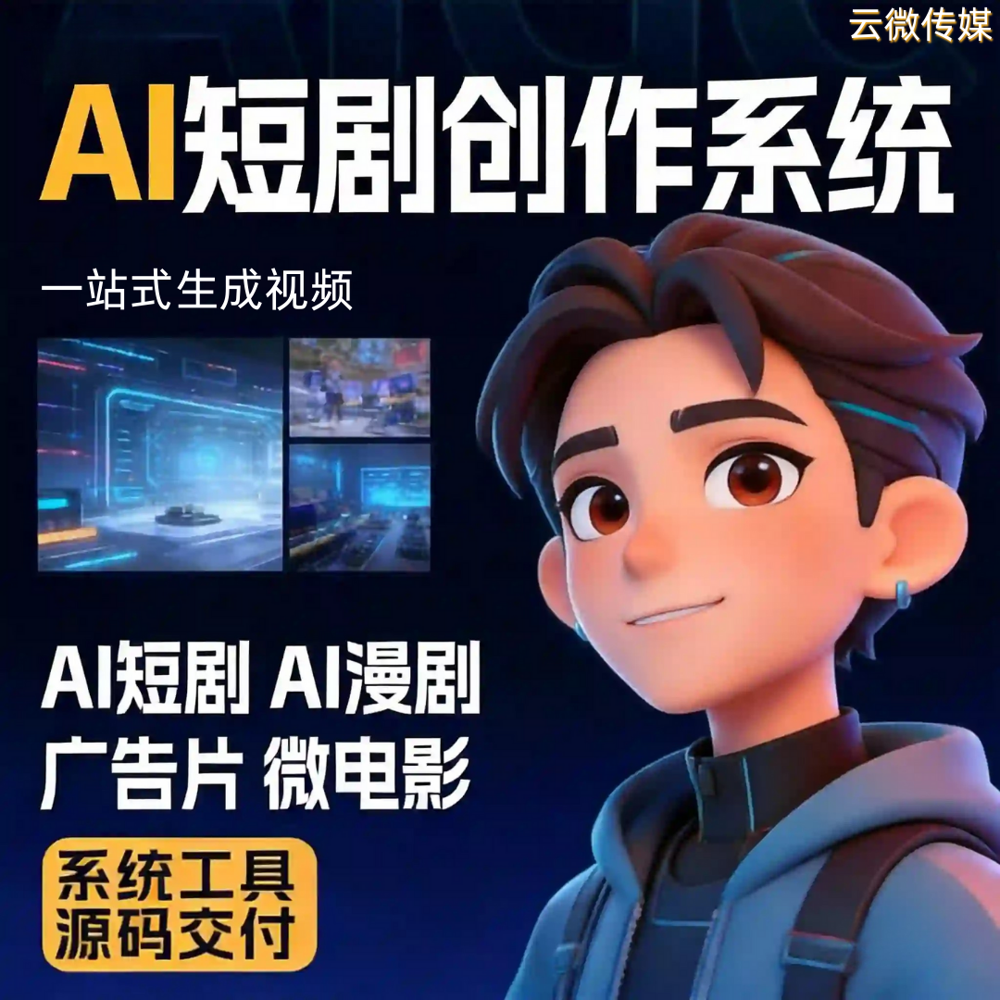

# 想做 AI 项目？从一套可贴牌、可商用的 AI 短剧创作系统开始

2026 年最稳的 AI 创业项目，不是高门槛的 AI 研发，而是轻资产、快落地、高变现的 AI 短剧 —— 不用懂算法、不用养技术团队，从一套可贴牌、可商用的 AI 短剧创作系统入手，零门槛开启 AI 创业之路✅

### 一、为什么 AI 创业，首选 AI 短剧系统？

- **风口稳、变现快**：AI 短剧是当下 AI 落地最成熟的赛道，用户付费意愿高、平台流量倾斜，上线就能变现，不用长期试错
- **门槛低、易上手**：无需 AI 技术基础、无需编程能力，系统全自动化操作，小白也能快速上手
- **轻资产、低风险**：不用重投入研发，不用租场地、招团队，一套系统就能启动，试错成本极低
- **可长期、可放大**：可贴牌做自有品牌，可批量做矩阵，可对外招商，后期可拓展多形态内容，盈利空间持续扩大

### 二、可贴牌 + 可商用，创业主动权全在你手里

- **✅ 可贴牌**：自定义 LOGO、域名、界面，打造专属品牌，用户只认你，长期沉淀自有品牌资产
- **✅ 可商用**：正规授权，支持短剧付费、广告植入、品牌定制、出海分发，所有变现方式都合规
- **✅ 零抽成**：收益全归自己，不被中间商分成、不被平台卡账，变现直接落袋为安
- **✅ 快上线**：1–3 天完成贴牌部署，不用等待，当天就能启动出片、运营变现

### 三、系统自带核心能力，不用额外投入

- **全流程自动化**：AI 自动生成剧本、角色、配音、字幕、成片，单人可批量产出
- **多形态适配**：短剧、漫剧、小说推文都能做，覆盖多赛道，降低单一变现风险
- **多平台适配**：生成的视频直接适配抖音、快手、视频号，一键导出发布，省却后期麻烦
- **可灵活升级**：支持独立部署、源码交付，后期可按需二开、新增功能，适配业务扩大需求

### 四、谁适合从这套系统起步做 AI 项目？

- 零技术、零经验，想轻资产创业的普通人
- 想转型 AI 赛道，不想重投入研发的工作室、小企业
- 有流量、有资源，想新增高变现项目的自媒体、MCN
- 想快速切入 AI 赛道，追求快落地、稳盈利的创业者

### 五、靠谱支撑，创业不踩坑

- 广州云微传媒 ——AI 短剧系统源头技术商，系统成熟稳定，经过大量商用实测；
- 提供贴牌部署、操作培训、长期售后，从 0 到 1 陪跑，解决所有运营、技术难题；
- 广州本地可上门对接、演示，让你创业无后顾之忧，轻松抓住 AI 短剧风口。

## 🤝 商务微信：ywyy6798

想做 AI 项目，不用死磕高门槛研发，选对切入点很重要。

一套可贴牌、可商用的 AI 短剧创作系统，让你零门槛、轻资产、快变现，不用懂技术、不用养团队，轻松开启 AI 创业，抢占 2026 年最稳的 AI 红利。

