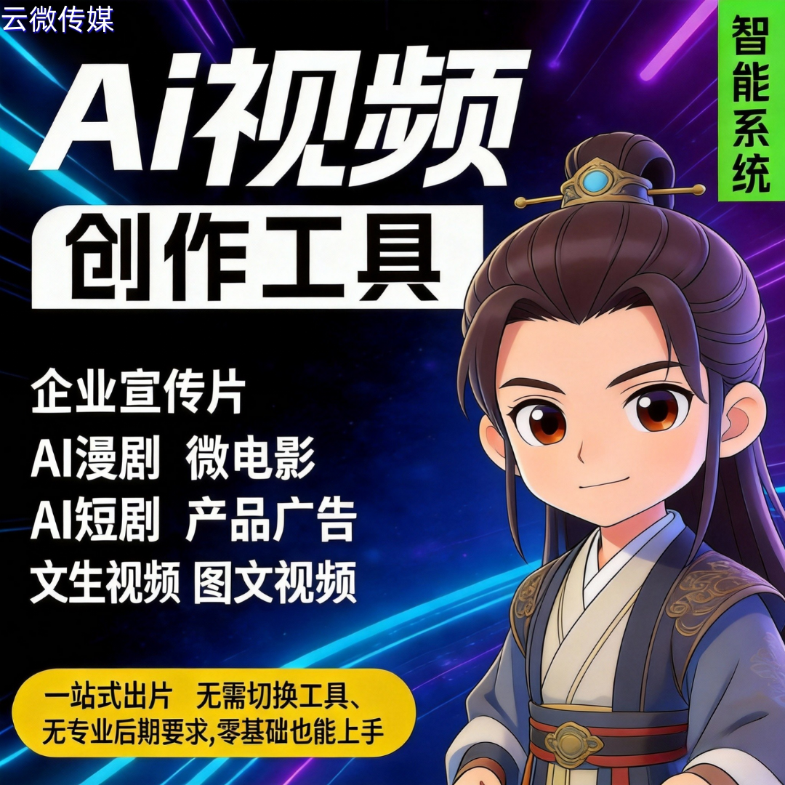

# 品牌做内容营销？自有 AI 短剧创作系统，内容可控、品牌可控

品牌做内容营销，最核心的焦虑是什么？—— 外包不可控、内容不贴合、数据有风险，花了钱还达不到品牌传播效果！

与其依赖外部团队、第三方平台，不如搭建一套自有 AI 短剧创作系统，从内容生产到品牌呈现，全程自主掌控，既省心又能强化品牌调性，适配品牌长期内容营销需求。

### 一、为什么品牌做内容营销，一定要有自有 AI 短剧系统？

- **摆脱外包依赖**：不用再对接编剧、剪辑、拍摄团队，不用反复修改调整，AI 全程自动化，内容产出效率翻倍，还能避免外包内容偏离品牌调性；
- **内容完全可控**：剧本、角色、场景、配音全由品牌自主定义，贴合品牌 VI 和核心价值观，杜绝违规、偏离品牌定位的内容，避免营销翻车；
- **品牌全程可控**：自定义角色形象、视觉风格、配音音色，打造品牌专属 IP，每一条短剧都是品牌宣传的载体，强化用户品牌记忆；
- **数据安全可控**：内容素材、用户数据、运营数据全部私有存储，不经过第三方平台，规避数据泄露风险，符合企业合规要求。

### 二、自有 AI 短剧创作系统，核心优势（适配品牌营销）

- **✅内容可控**：输入品牌关键词、营销需求，AI 自动生成贴合品牌的短剧剧本，可手动修改优化，确保内容传递品牌核心信息，不偏离、不违规；
- **✅品牌可控**：固定品牌专属角色、视觉画风、LOGO 露出，所有成片统一品牌调性，无论是产品推广还是品牌宣传，都能强化品牌辨识度；
- **✅效率可控**：AI 全流程自动化，从剧本生成、角色创建、配音合成到自动出片，几分钟产出一条，批量满足多平台、多场景营销需求；
- **✅成本可控**：省去外包、人力、设备成本，一次性投入，长期复用，边际成本趋近于零，适合品牌常态化内容营销。

### 三、品牌可直接用它做这些营销场景

- **产品推广**：生成产品功能短剧、使用教程、场景化种草视频，直观传递产品优势，助力转化；
- **品牌宣传**：打造品牌 IP 短剧、企业文化短片、公益向内容，传递品牌理念，提升品牌影响力；
- **活动营销**：节日活动、新品上线、线下引流等短剧，快速响应营销节点，提升活动曝光；
- **私域激活**：生成适配朋友圈、社群的短平快短剧，激活私域用户，提升用户粘性。

### 四、广州云微传媒，助力品牌搭建自有系统

- 源头技术直供，可私有化部署、贴牌定制，打造品牌专属 AI 短剧创作系统；
- 全程技术支持、操作培训，品牌员工无需专业技能，也能快速上手出片；
- 系统持续迭代，适配品牌营销新需求，广州本地可上门对接、演示，落地更放心；
- 数据私有、0 抽成，品牌完全掌控内容、数据和运营权，长期沉淀品牌资产。

## 🤝 商务微信：ywyy6798

品牌内容营销，“可控” 才是核心竞争力。

自有 AI 短剧创作系统，实现内容可控、品牌可控、数据可控，不用依赖外包、不用承担风险，既能高效产出优质营销内容，又能强化品牌调性，不管是中小企业还是知名品牌，都是常态化内容营销的最优解。

